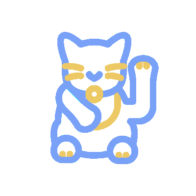

</img>
<h1 style= "text-align: center; color: #fca943;" > ~ WELCOME ~ 
<a href="https://lordicon.com" id="logo">icon from lordicon</a>
</h1>

## Hi there 👋

--More To Come--

<!--
**DraconMarius/DraconMarius** is a ✨ _special_ ✨ repository because its `README.md` (this file) appears on your GitHub profile.

Here are some ideas to get you started:

- 🔭 I’m currently working on ...
- 🌱 I’m currently learning ...
- 👯 I’m looking to collaborate on ...
- 🤔 I’m looking for help with ...
- 💬 Ask me about ...
- 📫 How to reach me: ...
- 😄 Pronouns: ...
- ⚡ Fun fact: ...
-->

<!-- *I might have a lot of ideas, but not all of them are good. So thank you for testing them out with me* -->
